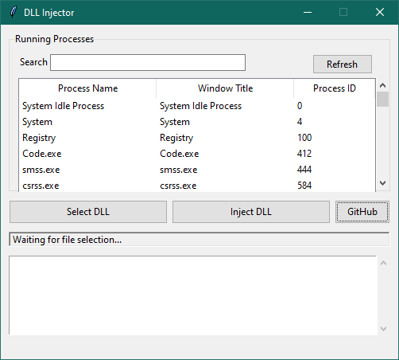

# DLL Injector

A Python-based GUI application for injecting DLLs into running processes on Windows. This tool is designed for educational purposes and should be used responsibly.

---

## Table of Contents
- [Features](#features)
- [Prerequisites](#prerequisites)
- [Usage](#usage)
- [How It Works](#how-it-works)
- [Contributing](#contributing)

---

## Features
- **Process Listing**: View a list of all running processes with their names, window titles, and process IDs.
- **Search Functionality**: Filter processes by name or PID.
- **DLL Injection**: Inject a DLL into a selected process.
- **Logging**: Detailed logs with timestamps and error levels.
- **Admin Privileges**: Ensures the application runs with administrator rights.
- **User-Friendly GUI**: Built with `tkinter` for ease of use.

---

## Prerequisites
Before using this tool, ensure you have the following installed:
- **Python 3.x**: Download and install Python from [python.org](https://www.python.org/).
- **Required Libraries**: Install the required Python libraries using `pip`.

---

## Usage

1. Run as Administrator: Ensure the application is run with administrator privileges.
2. Select a DLL: Click the "Select DLL" button to choose the DLL file you want to inject.
3. Choose a Process: Select a process from the list of running processes.
4. Inject DLL: Click the "Inject DLL" button to inject the selected DLL into the chosen process.
5. View Logs: Check the log area for detailed information about the injection process.

---

## How It Works
1. The DLL Injector uses the Windows API to:
2. Open a target process with PROCESS_ALL_ACCESS permissions.
3. Allocate memory in the target process using VirtualAllocEx.
4. Write the DLL path into the allocated memory using WriteProcessMemory.
5. Create a remote thread in the target process to load the DLL using CreateRemoteThread.
6. Clean up resources after injection.

---

## Contributing
Contributions are welcome! If you'd like to contribute, please follow these steps:
1. Fork the repository.
2. Create a new branch for your feature or bugfix.
3. Commit your changes.
4. Submit a pull request.

---

## Support
If you find this project useful, consider giving it a ⭐ on GitHub!
